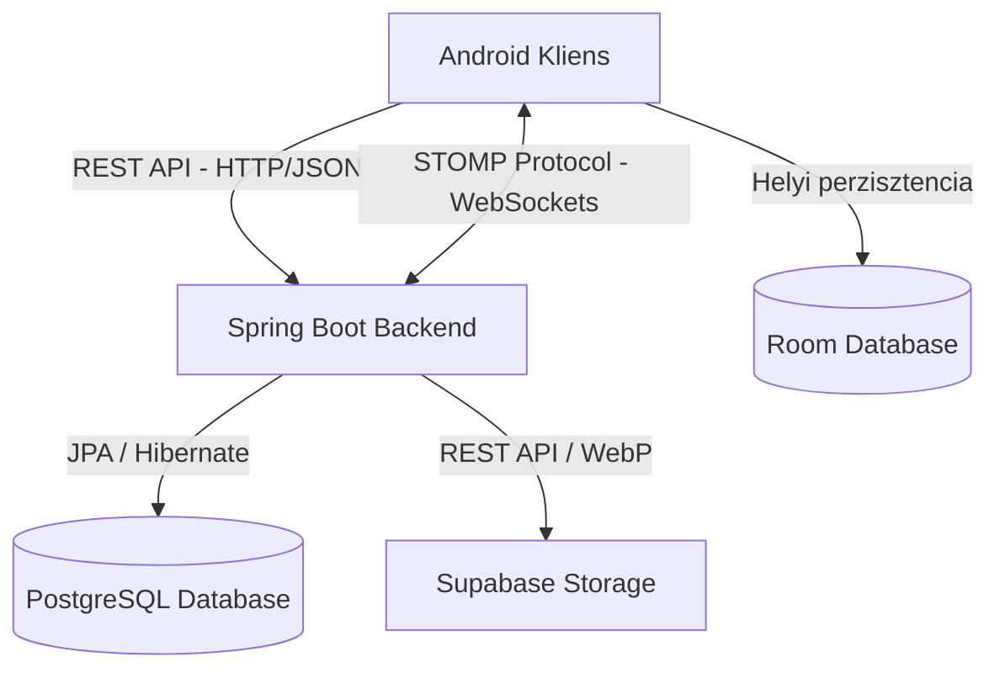

# Realtime Chat Application & Backend Service

Ez a projekt egy teljes körű (full-stack), biztonságos és valós idejű kommunikációs platform, amely egy **Spring Boot backend** szolgáltatásból és egy natív **Android kliens** alkalmazásból áll. A rendszer támogatja a privát (1:1) és a csoportos csevegést, a fejlett képfeldolgozást és felhőalapú tárolást, valamint a helyi adatbázis-alapú offline gyorsítótárazást a kiváló felhasználói élmény érdekében.

---

## Tartalomjegyzék
1. [Rendszerarchitektúra és Működés](#rendszerarchitektúra-és-működés)
2. [Backend Szolgáltatás (Spring Boot)](#backend-szolgáltatás-spring-boot)
3. [Android Mobilalkalmazás](#android-mobilalkalmazás)
4. [Adatbázis sémák és entitások](#adatbázis-sémák-és-entitások)
5. [API és WebSocket specifikáció](#api-és-websocket-specifikáció)
6. [Telepítés és Konfiguráció](#telepítés-és-konfiguráció)
7. [Fejlesztők és Feladatkiosztás](#fejlesztők-és-feladatkiosztás)

---

## Rendszerarchitektúra és Működés

Az alkalmazás egy modern, rétegelt kliens-szerver architektúrát követ, amelynél a hálózati kommunikáció két fő csatornán zajlik:



### 1. Kétcsatornás Kommunikáció
*   **REST API (HTTP/JSON)**: A kevésbé időérzékeny, tranzakciós műveletekhez használatos, mint például a regisztráció, a bejelentkezés, a felhasználók keresése, a csoportok létrehozása és a képek feltöltése.
*   **STOMP over WebSockets**: A valós idejű, kétirányú üzenetküldéshez és státuszfrissítésekhez (online/offline állapot). A kliens a csatlakozáskor JWT-vel hitelesíti magát a WebSocket csatornán egy egyedi csatorna-interceptoron keresztül.

### 2. Offline-First Megközelítés (Helyi gyorsítótárazás)
Az Android alkalmazás a **Room** adatbázist használja helyi gyorsítótárként. A UI réteg nem közvetlenül a hálózatról kéri az adatokat, hanem a Room adatbázisból származó reaktív adatfolyamokra (**RxJava Flowable**) iratkozik fel. 
*   Amikor a felhasználó megnyit egy csevegőszobát, a kliens azonnal megjeleníti a helyben tárolt korábbi üzeneteket (azonnali betöltés offline módban is).
*   Ezzel párhuzamosan a háttérben elindul egy szinkronizációs folyamat a REST API-n keresztül, ami letölti a legújabb üzeneteket, és frissíti a helyi Room adatbázist.
*   A WebSocketen érkező új valós idejű üzenetek szintén azonnal mentésre kerülnek a Room-ba, ami automatikusan triggereli a UI frissítését.

---

## Backend Szolgáltatás (Spring Boot)

A szerveroldali alkalmazás egy robusztus, Spring Boot alapú Java alkalmazás, amely a következő kulcsfontosságú modulokból áll:

### Alkalmazott Technológiák
*   **Futási környezet**: Java 21 LTS
*   **Keretrendszer**: Spring Boot 4.0.5 / 3.x
*   **Adatelérés**: Spring Data JPA / Hibernate
*   **Adatbázis**: PostgreSQL relációs adatbázis
*   **Biztonság**: Spring Security + Stateless JWT hitelesítés
*   **Valós idejű réteg**: Spring WebSocket + STOMP üzenetkezelés
*   **Képfeldolgozás**: Scrimage (WebP konverzió és átméretezés)
*   **Tárhely**: Supabase Storage REST integráció

### Főbb Backend Funkciók
1.  **JWT alapú Stateless Security**: Minden REST kérés és a WebSocket kézfogás is JWT token ellenőrzésen megy keresztül. A token lejárata 24 óra.
2.  **Automatizált Képoptimalizálás**: A profilképek és csoportképek feltöltésekor a szerver a **Scrimage** könyvtár segítségével a képeket automatikusan 512x512-es méretűre vágja (Cover scaling), és átkonvertálja rendkívül kis méretű **WebP** formátumba.
3.  **Supabase Cloud Storage**: A szerver nem helyben tárolja a képeket, hanem a Supabase Storage v1 REST API-ján keresztül feltölti azokat egy felhőalapú vödörbe (Bucket). A régi képek frissítéskor vagy törléskor automatikusan törlődnek a felhőből.

---

## Android Mobilalkalmazás

Egy natív Android alkalmazás, amely az MVVM (Model-View-ViewModel) architektúrát és a reaktív programozási mintákat követi.

### Alkalmazott Technológiák
*   **Fejlesztői nyelv**: Java
*   **Architektúra**: MVVM (ViewModel, LiveData)
*   **Függőség injektálás**: Dagger Hilt (v2.48)
*   **Reaktív programozás**: RxJava 2 és RxAndroid
*   **Hálózati réteg**: Retrofit 2 és OkHttp 4 (naplózó interceptorral)
*   **WebSocket kliens**: StompProtocolAndroid (NaikSoftware)
*   **Helyi adatbázis**: Room Database 2.6.1 (SQLite absztrakció RxJava támogatással)
*   **Képmegjelenítés**: Glide (intelligens kép-gyorsítótár)
*   **UI könyvtár**: Material Design 3

### Kliensoldali architektúra felépítése
*   **`di` csomag**: Tartalmazza a Dagger Hilt modulokat (`NetworkModule`, `DatabaseModule`, `WebSocketModule`), amelyek biztosítják a single-instance (Singleton) objektumok injektálását, valamint a `TokenManager`-t, amely memóriában tárolja az aktuális session tokent.
*   **`data` csomag**: A helyi Room adatbázis sémáit, DAO-kat (`ChatRoomDao`, `MessageDao`) és a `ChatRepository`-t tartalmazza, amely összefogja a helyi adatbázis és a távoli API szinkronizálását.
*   **`ui` csomag**: A felhasználói felület Fragmentjei (`LoginFragment`, `ChatsFragment`, `ChatScreenFragment`, `ProfileFragment` stb.). A Fragmentek kizárólag a `MainViewModel`-en keresztül kommunikálnak az adatokért.

---

## Adatbázis sémák és entitások

### 1. Szerveroldali PostgreSQL séma (JPA)

#### `users` tábla
Egyedi felhasználókat tárol.
*   `id` (UUID, Primary Key)
*   `username` (VARCHAR, Unique, Not Null)
*   `email` (VARCHAR, Unique, Not Null)
*   `password` (VARCHAR, Not Null) - Bcrypt hash-elt jelszó
*   `is_online` (BOOLEAN) - Valós idejű jelenlét státusza
*   `is_deleted` (BOOLEAN) - Logikai törlés jelzője

#### `chat_room` tábla
Beszélgetőszobákat tárol.
*   `id` (UUID, Primary Key)
*   `name` (VARCHAR, Not Null) - Csoport neve vagy privát chat esetén alapértelmezett név
*   `is_group` (BOOLEAN) - Csoportos beszélgetés-e
*   `is_deleted` (BOOLEAN)
*   `group_image_url` (VARCHAR) - Supabase CDN link a csoport képéhez
*   `group_image_bucket_path` (VARCHAR) - Supabase tárhely elérési út a törléshez
*   `last_message_id` (UUID, Foreign Key) - Hivatkozás a legfrissebb üzenetre az előnézethez

#### `chat_room_users` kapcsolótábla
Több-a-többhöz kapcsolat a szobák és felhasználók között.
*   `chat_room_id` (UUID, Foreign Key)
*   `user_id` (UUID, Foreign Key)

#### `message` tábla
A beszélgetések üzenetei.
*   `id` (UUID, Primary Key)
*   `content` (TEXT, Not Null)
*   `timestamp` (TIMESTAMP, CreationTimestamp)
*   `is_deleted` (BOOLEAN)
*   `sender_id` (UUID, Foreign Key -> `users.id`)
*   `chat_room_id` (UUID, Foreign Key -> `chat_room.id`)

#### `profile_images` tábla
A felhasználók egyedi profilképei.
*   `id` (UUID, Primary Key)
*   `user_id` (UUID, Foreign Key -> `users.id`, Unique)
*   `bucket_path` (VARCHAR, Not Null)
*   `public_url` (VARCHAR, Not Null)

---

### 2. Kliensoldali Room adatbázis séma (SQLite)

#### `chat_rooms` tábla
*   `chatRoomId` (UUID, Primary Key, Non-Null)
*   `name` (TEXT)
*   `isGroup` (BOOLEAN)
*   `lastMessage` (TEXT)
*   `lastMessageTimestamp` (TEXT)
*   `profileImageUrl` (TEXT)

#### `messages` tábla
*   `id` (UUID, Primary Key, Non-Null)
*   `content` (TEXT)
*   `senderUsername` (TEXT)
*   `chatRoomId` (UUID)
*   `timestamp` (TEXT)

---

## API és WebSocket specifikáció

### 1. REST API Végpontok

| Metódus | Végpont | Leírás | Autentikáció |
| :--- | :--- | :--- | :--- |
| **POST** | `/api/auth/register` | Új felhasználó regisztrációja | Nem szükséges |
| **POST** | `/api/auth/login` | Bejelentkezés, visszatérési érték a JWT token | Nem szükséges |
| **GET** | `/api/users/me` | Bejelentkezett felhasználó saját adatainak lekérése | Bearer Token |
| **PUT** | `/api/users/me` | Felhasználói profil (email, jelszó, név) módosítása | Bearer Token |
| **POST** | `/api/users/{userId}/profile-image` | Felhasználói profilkép feltöltése (Multipart) | Bearer Token |
| **GET** | `/api/users/search` | Felhasználók keresése név alapján query paraméterrel | Bearer Token |
| **GET** | `/api/users/recommended` | Ajánlott felhasználók listázása | Bearer Token |
| **GET** | `/api/users/all` | Az összes regisztrált felhasználó lekérése | Bearer Token |
| **POST** | `/api/rooms/create` | Új privát (1:1) vagy csoportos csevegő létrehozása | Bearer Token |
| **GET** | `/api/rooms` | A bejelentkezett felhasználó aktív chatszobáinak listája | Bearer Token |
| **PUT** | `/api/rooms/{roomId}/name` | Csoportos beszélgetés nevének frissítése | Bearer Token |
| **POST** | `/api/rooms/{roomId}/image` | Csoportkép feltöltése és frissítése (Multipart) | Bearer Token |
| **GET** | `/api/messages/{chatRoomId}` | Adott chatszoba üzeneteinek lekérése lapozva | Bearer Token |

### 2. WebSocket (STOMP) Protokoll

*   **Kapcsolódási végpont (Endpoint)**: `ws://[HOST]:8080/ws/websocket` (SockJS támogatással: `/ws`)
*   **Hitelesítés**: A csatlakozási (CONNECT) kérés `Authorization` fejlécében kötelező elküldeni a `Bearer <token>` értéket.

#### WebSocket Desztinációk

*   **Üzenetküldés (Kliens -> Szerver)**:
    *   **Cím**: `/app/chat.sendMessage`
    *   **Payload**:
        ```json
        {
          "content": "Szia, ez egy valós idejű üzenet!",
          "chatRoomId": "d3b07384-d113-4ec5-a5d6-d05ca1e23e20"
        }
        ```
*   **Üzenet fogadása (Feliratkozás: Szerver -> Kliens)**:
    *   **Cím**: `/topic/rooms/{chatRoomId}`
    *   A szerver erre a csatornára küldi ki a szobában elküldött új üzeneteket minden aktív tagnak.

---

## Telepítés és Konfiguráció

### Szerveroldali Beállítások (Backend)

1.  **Előfeltételek**:
    *   Java 21 JDK telepítve
    *   PostgreSQL adatbázis futtatása (helyi vagy felhőalapú pl. Supabase)
    *   Egy Supabase projekt és egy nyilvános (Public) Storage Bucket létrehozása `Images` névvel.
2.  **Környezeti változók / Properties**:
    Hozzon létre egy `src/main/resources/application-local.properties` fájlt a saját beállításaihoz:
    ```properties
    DB_URL=jdbc:postgresql://[ADATBAZIS_HOST]:5432/[ADATBAZIS_NEV]
    DB_USERNAME=[FELHASZNALONEV]
    DB_PASSWORD=[JELSZO]
    SUPABASE_URL=https://[PROJEKT_ID].supabase.co
    SUPABASE_SERVICE_KEY=[SUPABASE_ANON_VAGY_SERVICE_ROLE_KULCS]
    ```
3.  **Futtatás**:
    Futtassa a Spring Boot alkalmazást a Maven wrapper segítségével:
    ```bash
    ./mvnw spring-boot:run
    ```

### Android Kliens Beállítások

1.  **Hálózati végpont beállítása**:
    *   Ha Android Emulátort használ, a helyi gépen futó backendet a `10.0.2.2` IP-címen éri el.
    *   Módosítsa a `WebSocketManager.java` fájlban a kapcsolat URL-t:
        ```java
        private static final String WS_URL = "ws://10.0.2.2:8080/ws/websocket";
        ```
    *   Módosítsa a Retrofit API bázis URL-jét a `di/NetworkModule.java` fájlban, hogy a helyes IP-címre mutasson.
2.  **Futtatás**:
    *   Nyissa meg a `RealTimeChatApplication` mappát Android Studio-ban.
    *   Várja meg, amíg a Gradle szinkronizál.
    *   Futtassa az alkalmazást egy emulátoron vagy fizikai eszközön (min. Android 7.0 - API 24).
